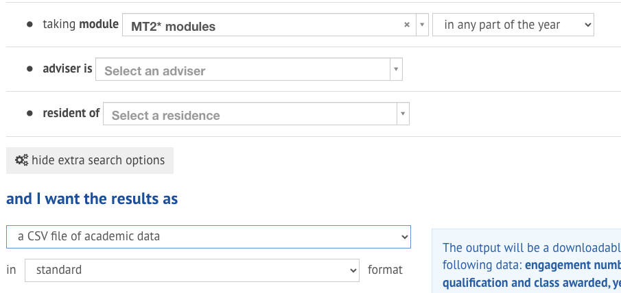
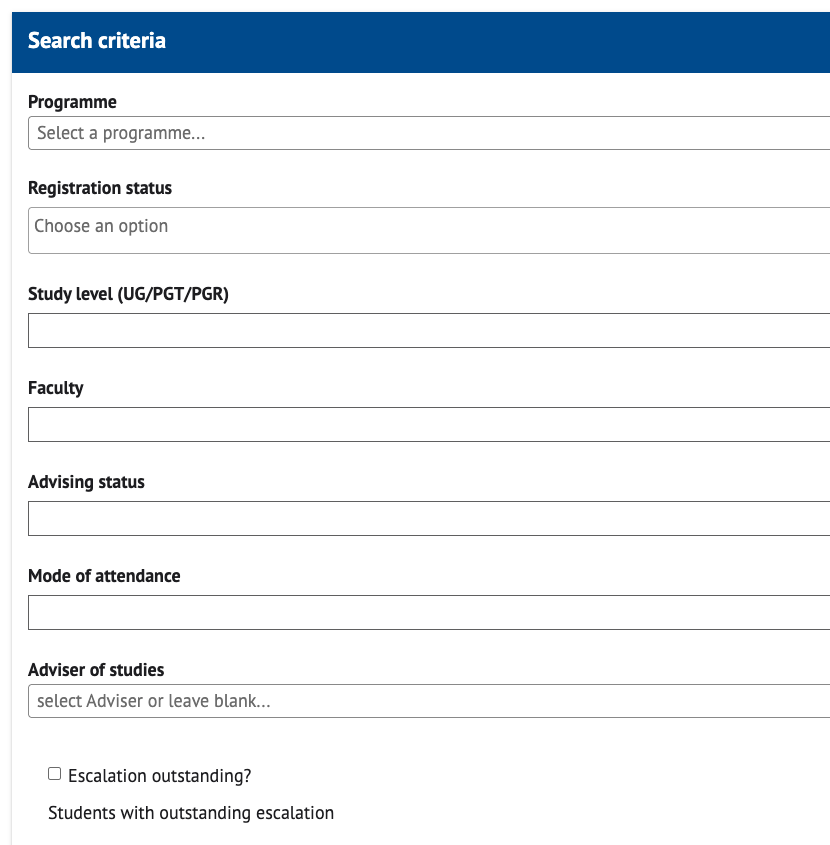

# StA_Advising
This repository provides a tool to help with Honours advising in the School of Mathematics and Statistics at the University of St Andrews.

# Usage
The tool operates from command line. Currently it can process single Honours choice forms from individual students, or a folder containing multiple such forms. To use the script on an Honours choice form, navigate to the folder where `advising_tool.py` is saved and type

```
python advising_tool.py form_file.xlsx
```

If you wish to process a folder of form files, simply replace the `form_file.xlsx` with the folder name.

The tool has an option to overwrite the programme of study in the student data base, so that it's possible to check module choices against different programme requirements than the current degree intention of the student. To do so, invoke the script with the additional command line option `-p`, as in

```
python advising_tool.py -p "programme name" form_file.xlsx
```

Here, the the programme name needs to exactly match one of the options listed on University of St Andrews programme requirements website:

https://e-vision.st-andrews.ac.uk/cview/reqs/2025-26/list.html?v=dp

The tool has an additional option to provide a year of study. For most students, the script will correctly infer the year of study from other provided data. Should the output be corrupted because the inferred year is wrong, it may help to provide the year of study for an individual student via

```
python advising_tool.py -y YEAR form_file.xlsx
```

Here, YEAR will need to be an integer value. Note, that contrary to other St Andrews systems the tool counts the year of study as 1-based for students who started their programme via direct entry, i.e. for a direct entry student the honours years are counted as year 2 and year 3, instead of year 3 and year 4 of the programme.

The tool will save it's findings into an excel file as well as a Microsoft Word file, and also print everything to command line. The output files are `summary_file.xlsx` and `summary_file.xlsx`. You can save into different files by typing

```
python advising_tool.py -o other_file_name.xlsx form_file.xlsx
```

One can get a brief description of the command line arguments by typing

```
python advising_tool.py --help
```

If you would prefer other output formats, let Jochen know.

# Installation and file setup
Installation of this tool requires three steps: (i) Installing python dependencies, (ii) Downloading the code from this repository and (iii) Donwloading student data files from MMS.

## Installing python 
If you don't have python installed on your computer, I recommend installing anaconda (https://www.anaconda.com/). Once python is installed, you need to install a small number of python packages by typing

```
pip install openpyxl
pip install pandas
pip install termcolor
pip install python-docx
pip install jinja2
pip install xlsxwriter
```

## Getting the code
You'll find options for downloading the code by clicking on the green button 'Code' on the top right. For example, if you have ssh access setup in your github user account, you could navigate to the folder you'll want to use and type

```
git clone git@github.com:kursawe/StA_Advising.git
```

Downloading a .zip file and extracting it is also an option. 

## Accessing student data files

This instruction applies in particular to advisors. To access student module data navigate to the website

https://www.st-andrews.ac.uk/studentrecords/

then click on 'Show extra search options'. This will open up new options to select catagories for students whose files we would like to access. In the section 'taking module' select 'MT2* modules'. Then, under 'and I want the results as' select 'a CSV file of academic data' in 'standard' format.
This should look something like this:


Click the 'Search' button and save the generated file in the subfolder `student_data`, which is part of the repository file structure. In some cases, this will result in an error noting 'Too many results'. In those cases, download multiple files for the selection by further restricting the 'in any part of the year' option to 'in semester 1', 'in semester 2', and 'spanning the whole year', consecutively. 

Repeat the process three times by selecting 'MT3* modules', 'MT4* modules' and also 'MT5* modules'.

## Optionally download year-of-study data from the advising system

Advisers can optionally download an additional file containing the year of study for each student. This option is recommended. To do so, enter the advising interface and click on 'Search for student' in the left-hand panel. In the resulting interface, select 'Advanced search'. The page should look like this:


Without making any selection in the available drop-down menus, simply click on 'Search'. In the resulting interface, click on 'Excel' in the top right corner, and download the file into a location of your choosing. Finally, open the resulting file in Microsoft Excel and save it from Excel into the subfolder `student data` of this repository. The additional step of saving from Excel is necessary to ensure that the saved file format is compatible with the advising tool.

When available, the advising tool will use this additional file to read in the year of study for individual students. If the file is not provided, the tool will infer the year of study from the module record of the student, which can give wrong results in some cases, for example for students who have taken a Leave of Absence for individual semesters. 

# Functionality
The tool will check programme requirements, check that modules are running in the selected semesters, it will check for timetable clashes among MT modules, and it will check prerequisites. The script works for students entering Honours as well as returning honours students.

In the module choice forms, the code relies on the fact that a valid student ID is in cell 'D5'. Module choices are identified by their heading. That means, the form can be read even if empty lines or sections are deleted in the module choice form. However, adding or deleting columns may stop the form from being read.

When accessing student data, the will take as much data from the official data records as possible and minimise the input from the form. That means, the only data read from the module choice forms are the student ID and the selected module codes under each relevant header. If a student is a returning honours student, module choices for previously taken honours years are found in the student data base. Only module choices for planned honours years are read from the module choice form.

# Troubleshooting and known issues
The officially available records do not contain data on the year of study. Hence, the tool infers the year of study and the honours year based on the first year a module was taken, and on the number of subhonours years. This will go wrong if a student is studying part time or has been on leave of absence.

The tool has not been tested extensively, and errors are expected. That means, output from the tool will need to be double-checked.

Specifically, module data for MT modules is read from `module_catalogue/module_catalogue.xlsx`, which as been manually curated with the help of ChatGPT. That file probably contains errors and may not be fully up-to-date.

Finally, the code has only been tested on MacOS. The coloured command line output may look wrong on Windows. Please let Jochen know if that's the case.

# Improving the tool

Please help in improving this tool! To do so, please let Jochen know if you spot any errors in the output.

Additionally, you may notice checks and tests that you would like the tool to do, and which are currently not implemented. Please let Jochen know about these also. The code structure is modular and should allow quick additions of further tests.

Finally, every tool gets better the more collaborators are looking over the code. If you would be open for code-review or contributing to the repository, please let Jochen know and he can give you github access to the repository.

# File structure
For anyone interested, this is a quick explanation of the file struture

- `advising_tool.py`: This file does the command line parsing and calls the actual code in the  `src/advising` folder.
- `src/advising/__init__.py`: This file is part of how python works, and allows us to load the code from all other files in the folder into the main namespace whenever `src/advising` gets imported from within python.
- `src/advising/student.py`: This file defines the main datastructure that we are using inside our checks, the 'Student' class. This is a python class which allows us to curate all information about a student in one object, thus allowing us quick access to which modules have been taken, which modules the student planning to take, which year they are in, etc.
- `src/advising/infrastructure.py`: This file contains the code to read and write files, and multiple helper functions that we use when checking programme requirements and timetable clashes etc.
- `src/advising/programme_requirements.py`: This file contains the code that checks programme requirements.
- `src/advising/prerequisites.py`: This file contains the code that works out whether a student meets the prerequisites for selected modules.
- `src/advising/timetabling.py`: This file contains the code that checks for timetable clashes, and whether modules are running as selected.
- `pyproject.toml`: This file defines how the advising code should be installed (e.g. via `pip install .`)

### Files related to the module catalogue
- `src/advising/Module_catalogue.xlsx`: This file contains the data for modules, their timetabling, and their pre/anti-requisites.
- `src/advising/test_catalogue_differences.m`: This file is a matlab function to compare two versions of the module catalogue.
- `src/advising/write_honours_timetable.m`: This file is a matlab function to write the Honours module timetable over the next 3 years based on the module catalogue input excel file. It calls the following functions
  - `src/advising/load_MC_honours.m`:  This file is a matlab function that loads the excel module catalogue into matlab
  - `src/advising/make_honours_timetable.m`: This file is a matlab function that makes the Honours module timetable for a given semester and given year.
